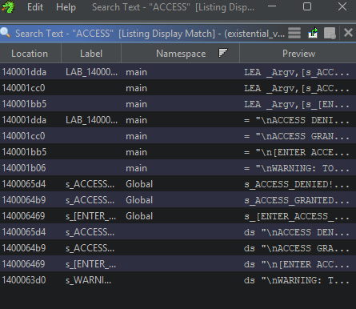
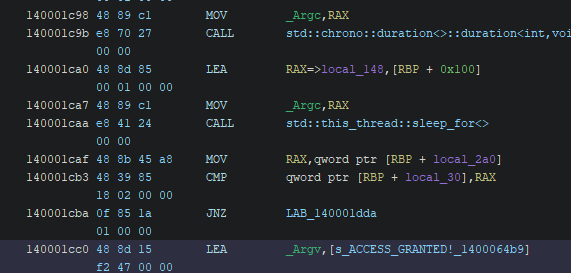
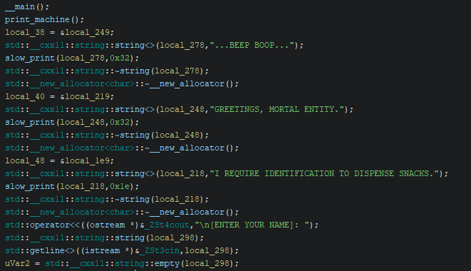
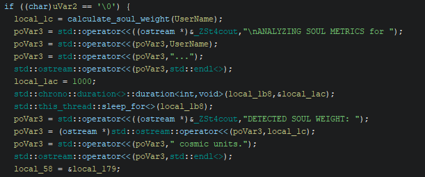
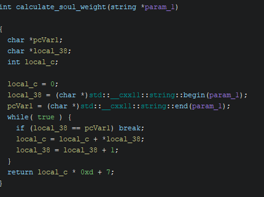
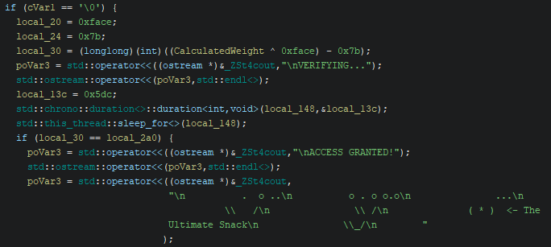
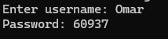
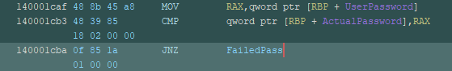

# CrackMe Write-Up: DonCris's Existential Vending Machine

| | |
|---|---|
| **Author (of CrackMe)** | DonCris |
| **Language** | C/C++ |
| **Platform** | Windows (x86-64) |
| **Difficulty** | 1.7 |
| **Quality** | 4.7 |
| **Upload Date** | 2026-01-10 |

---

## Step 1: Startup & Initial Testing

Today we are analyzing a keygen / math-related password CrackMe. Opening the program presents a neat ASCII vending machine UI:

```text
   _________________________________________
  |  _____________________________________  |
  | |                                     | |
  | |   [ EXISTENTIAL VENDING MACHINE ]   | |
  | |                                     | |
  | |   [A1] Meaning of Life    $??.??    | |
  | |   [B2] Instant Regret     $ 0.99    | |
  | |   [C3] The Ultimate Key   LOCKED    | |
  | |_____________________________________| |
  | |_____________________________________| |
  |               [_______]                 |
  |                |     |                  |
  |                | PUSH|                  |
  |________________|_____|__________________|

...BEEP BOOP...
GREETINGS, MORTAL ENTITY.
I REQUIRE IDENTIFICATION TO DISPENSE SNACKS.

[ENTER YOUR NAME]:
```

Testing input with `Omar`:

```text
ANALYZING SOUL METRICS for Omar...
DETECTED SOUL WEIGHT: 5194 cosmic units.

WARNING: TO UNLOCK ITEM [C3], YOU MUST PROVIDE THE ACCESS CODE.
HINT: The code is hidden in the silence between the stars... or just basic math.

[ENTER ACCESS CODE]:
```

Entering the name alone doesn't trigger any validation errors, but the program outputs a calculated `SOUL WEIGHT`. That weight value feels like a prime candidate for the math check later on.

---

## Step 2: String Searching in Ghidra

Opening the executable in Ghidra, searching for the word `"access"` quickly reveals the core logic path, including `\nACCESS GRANTED!` at assembly address `140001cc0`:



*Search results for the string "ACCESS" in Ghidra.*

```asm
140001cba 0f 85 1a 01 00 00   JNZ   LAB_140001dda
140001cc0 48 8d 15 f2 47 00 00 LEA   _Argv, ["\nACCESS GRANTED!"]
140001cc7 48 8b 05 22 4d 00 00 MOV   RAX, qword ptr [->_ZSt4cout]
```



*Disassembly showing the JNZ leading to the ACCESS GRANTED string.*

Tracing back to the main function decompilation:

```c
std::operator<<((ostream *)&_ZSt4cout, "\n[ENTER YOUR NAME]: ");
std::__cxx11::string::string(local_298);
std::getline<>((istream *)&_ZSt3cin, local_298);
uVar2 = std::__cxx11::string::empty(local_298);
```



*Start of main decompilation with the intro strings and name prompt.*

Since `std::getline` reads our input string into `local_298`, renaming `local_298` to **`UserName`** clarifies the rest of the routine.

---

## Step 3: Deconstructing `calculate_soul_weight`

Moving down to the soul weight calculation:

```c
if ((char)uVar2 == '\0') {
    local_1c = calculate_soul_weight(UserName);
    poVar3 = std::operator<<((ostream *)&_ZSt4cout, "\nANALYZING SOUL METRICS for ");
    poVar3 = std::operator<<(poVar3, UserName);
    poVar3 = std::operator<<(poVar3, "...");
    // ... sleep delay ...
    poVar3 = std::operator<<((ostream *)&_ZSt4cout, "DETECTED SOUL WEIGHT: ");
    poVar3 = (ostream *)std::ostream::operator<<(poVar3, local_1c);
    poVar3 = std::operator<<(poVar3, " cosmic units.");
}
```



*Call site of calculate_soul_weight and the soul weight output.*

Renaming `local_1c` to **`CalculatedWeight`** and looking inside `calculate_soul_weight()`:

```c
int calculate_soul_weight(string *param_1) {
    char *pcVar1;
    char *local_38;
    int local_c;

    local_c = 0;
    local_38 = (char *)std::__cxx11::string::begin(param_1);
    pcVar1 = (char *)std::__cxx11::string::end(param_1);

    while( true ) {
        if (local_38 == pcVar1) break;
        local_c = local_c + *local_38;
        local_38 = local_38 + 1;
    }
    return local_c * 0xd + 7;
}
```



*Decompiled body of calculate_soul_weight.*

### Routine Breakdown:

1. Pointers are initialized to the start (`begin`) and end (`end`) of the `UserName` string.
2. A loop iterates character-by-character, accumulating the ASCII values into `local_c` (**`LettersSum`**).
3. The function returns `(LettersSum * 0xD) + 7` (or `(LettersSum * 13) + 7` in decimal).

---

## Step 4: Reverse Engineering the Password Calculation

Continuing past the name processing:

```c
std::operator<<((ostream *)&_ZSt4cout, "\n[ENTER ACCESS CODE]: ");
plVar4 = (longlong *)std::istream::operator>>((istream *)&_ZSt3cin, &local_2a0);
```

Renaming `local_2a0` to **`UserPassword`**.

Next comes the verification check:

```c
local_20 = 0xface;
local_24 = 0x7b;
local_30 = (longlong)(int)((CalculatedWeight ^ 0xface) - 0x7b);

poVar3 = std::operator<<((ostream *)&_ZSt4cout, "\nVERIFYING...");
// ... sleep delay ...

if (local_30 == UserPassword) {
    poVar3 = std::operator<<((ostream *)&_ZSt4cout, "\nACCESS GRANTED!");
}
```



*Verification logic comparing calculated password against user input.*

Renaming `local_30` to **`ActualPassword`**. The formula evaluates as:

$$\text{ActualPassword} = (\text{CalculatedWeight} \oplus 0\text{xFACE}) - 0\text{x7B}$$

Where $0\text{xFACE} = 64206$ and $0\text{x7B} = 123$.

At runtime, testing confirms the prompts and flow:



*Runtime prompt showing username and password entry.*



*Final comparison instruction (CMP) before the JNZ branch decides pass/fail.*

---

## Step 5: Keygen Implementation

Putting both formulas together into Python yields a working keygen:

```python
def generate_password(username: str) -> int:
    # 1. Sum ASCII values of all characters in the username
    ascii_sum = sum(ord(char) for char in username)

    # 2. Compute Soul Weight: (Sum * 13) + 7
    calculated_weight = (ascii_sum * 13) + 7

    # 3. Compute Access Code: (Weight XOR 0xFACE) - 0x7B
    return (calculated_weight ^ 0xFACE) - 0x7B

user = input("Enter username: ")
print("Generated Access Code:", generate_password(user))
```


---

## Step 6: Alternative Bypasses

If the goal were simply to bypass the check rather than build a valid keygen:

1. **Binary Patching:** Patch `140001cba JNZ LAB_140001dda` to `NOP`s so any password input passes directly into `ACCESS GRANTED!`.
2. **Debugger Breakpoint:** Set a breakpoint at `140001cba` in x64dbg, inspect the value stored in register/memory for `local_30`, and enter that value manually at the prompt.

---

Seems like the existential vending machine might have a meaning 
see you next time ;)
