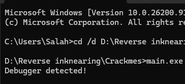
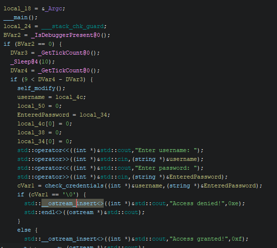
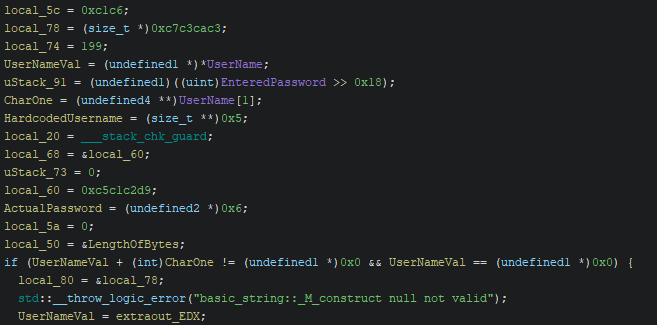
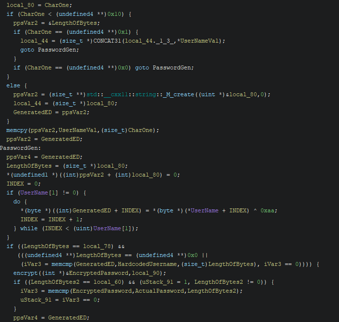
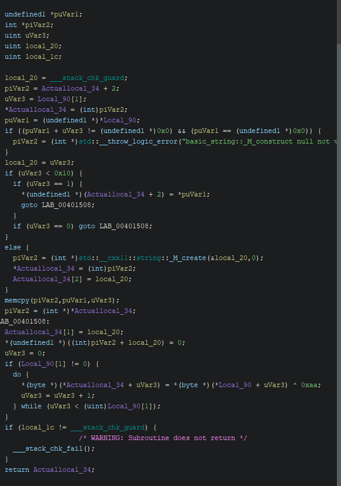
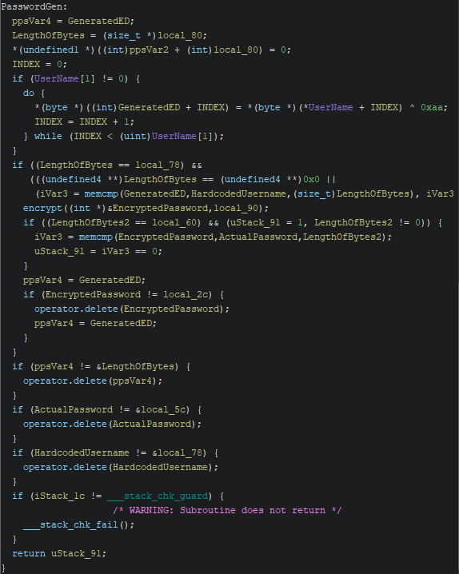
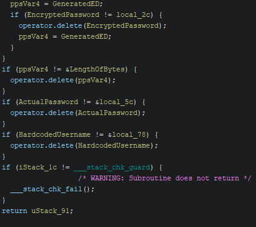

# CrackMe Write-Up: JapaCZECH's Medium Crackme

| | |
|---|---|
| **Author (of CrackMe)** | [JapaCZECH](https://crackmes.one/user/JapaCZECH) |
| **Language** | C/C++ |
| **Platform** | Windows (x86) |
| **Difficulty** | 2.8 |
| **Quality** | 4.7 |
| **Upload Date** | 2024-07-26 |
| **Labels** | Anti-debugging, IsDebuggerPresent, String / data encryption, XOR |

---

## Step 1: First Run — Immediate Rejection

Run the binary and you get this:



```
Debugger detected!
```

Didn't even get a chance to enter anything. The program knows what you're doing before you do anything. Rude.

Since I'm doing pure static analysis in Ghidra though, this doesn't matter. Let's go find out why.

---

## Step 2: Main Function — Three Layers of Anti-Debug

Looking at the main function:



```c
BVar2 = _IsDebuggerPresent@0();
if (BVar2 == 0) {
    DVar3 = _GetTickCount@0();
    _Sleep@4(10);
    DVar4 = _GetTickCount@0();
    if (9 < DVar4 - DVar3) {
        self_modify();
        // actual logic here
    }
}
iVar5 = 1;
std::__ostream_insert<>((int *)&std::cout,"Debugger detected!",0x12);
```

Three layers protecting the real logic:

**Layer 1 — IsDebuggerPresent:**
Checks the PEB directly. If a debugger is attached, returns 1 and jumps straight to "Debugger detected!" — you never even see the login prompt.

**Layer 2 — Timing check:**
Even if you bypass IsDebuggerPresent, the program takes a timestamp, sleeps 10ms, takes another timestamp. If the difference is less than 9ms, it knows something is wrong. A debugger slows execution down — this catches it.

**Layer 3 — self_modify():**
If you somehow pass both checks, `self_modify()` runs before the actual logic. The program modifies its own code at runtime. This completely invalidates any static analysis you did on the original binary.

Three layers of anti-debug stacked on top of each other. JapaCZECH was not playing around.

Since I'm doing static analysis and not actually running it, all three are irrelevant to me. I just need to find the credentials in the decompiled code.

---

## Step 3: Hardcoded Values

Inside `check_credentials`, the first thing that catches the eye is the stack initialization:



```c
local_5c = 0xc1c6;
local_78 = (size_t *)0xc7c3cac3;
local_74 = 199;
local_60 = 0xc5c1c2d9;
HardcodedUsername = (size_t **)0x5;
ActualPassword = (undefined2 *)0x6;
```

Key observations:
- `local_78` with value `0xc7c3cac3` and `local_74 = 199 (0xc7)` — these bytes together in little endian form the encrypted username
- `local_60 = 0xc5c1c2d9` and `local_5c = 0xc1c6` — these are the encrypted password bytes
- `HardcodedUsername = 0x5` — username length is 5
- `ActualPassword = 0x6` — password length is 6

---

## Step 4: Username XOR Loop

The username validation logic:



```c
do {
    *(byte *)((int)GeneratedED + INDEX) = *(byte *)(*UserName + INDEX) ^ 0xaa;
    INDEX = INDEX + 1;
} while (INDEX < (uint)UserName[1]);
```

The program XORs our input with `0xaa` then compares it against the hardcoded value.

**Reversing the username:**

Since XOR is reversible (XOR something twice = original), we XOR the hardcoded bytes with `0xaa`:

```
0xc3 ^ 0xaa = 0x69 = 'i'
0xca ^ 0xaa = 0x60 = '`'
0xc3 ^ 0xaa = 0x69 = 'i'
0xc7 ^ 0xaa = 0x6d = 'm'
0xc7 ^ 0xaa = 0x6d = 'm'
```

**Username: i\`imm**

---

## Step 5: Password Encryption Function

After the username check passes, the program calls `encrypt()`:



```c
do {
    *(byte *)(*Actuallocal_34 + uVar3) = *(byte *)(*Local_90 + uVar3) ^ 0xaa;
    uVar3 = uVar3 + 1;
} while (uVar3 < (uint)Local_90[1]);
```

Same pattern — XOR with `0xaa`. The encrypt function takes the entered password, XORs it with `0xaa`, then compares it against the hardcoded encrypted password bytes.

**Reversing the password:**

```c
local_60 = 0xc5c1c2d9;  // 4 bytes in little endian: 0xd9, 0xc2, 0xc1, 0xc5
local_5c = 0xc1c6;       // 2 bytes in little endian: 0xc6, 0xc1
```

XORing each byte with `0xaa`:

```
0xd9 ^ 0xaa = 0x73 = 's'
0xc2 ^ 0xaa = 0x68 = 'h'
0xc1 ^ 0xaa = 0x6b = 'k'
0xc5 ^ 0xaa = 0x6f = 'o'
0xc6 ^ 0xaa = 0x6c = 'l'
0xc1 ^ 0xaa = 0x6b = 'k'
```

**Password: shkolk**

---

## Step 6: Password Check Logic

The full comparison chain:



```c
if ((LengthOfBytes == local_78) &&
   (((undefined4 **)LengthOfBytes == (undefined4 **)0x0 ||
    (iVar3 = memcmp(GeneratedED,HardcodedUsername,(size_t)LengthOfBytes), iVar3 == 0)))) {
    encrypt((int *)&EncryptedPassword,local_90);
    if ((LengthOfBytes2 == local_60) && (uStack_91 = 1, LengthOfBytes2 != 0)) {
        iVar3 = memcmp(EncryptedPassword,ActualPassword,LengthOfBytes2);
        uStack_91 = iVar3 == 0;
    }
}
```

The flow:
1. XOR our username with `0xaa`
2. Compare result against hardcoded encrypted username
3. If username passes, call `encrypt()` on our password
4. Compare encrypted password against hardcoded encrypted password
5. Both must match for "Access granted!"

---

## Step 7: Cleanup Logic



Standard C++ string cleanup — the function properly deallocates strings after validation. Nothing suspicious here, just confirming the flow ends cleanly after the credential check.

---

## Credentials

```
Username: i`imm
Password: shkolk
```

Couldn't test dynamically due to the anti-debug layers, but the static analysis of the XOR operations is clean and the math checks out.

---

## Analysis Summary

**What made this 2.8:**
- Three stacked anti-debug layers (IsDebuggerPresent + timing + self-modification)
- Two-stage credential validation (username then password)
- XOR encryption on both credentials using the same key (0xaa)
- Little-endian byte ordering on the hardcoded values

**The key insight:** Anti-debugging only matters if you're running the binary. Static analysis bypasses all three layers entirely — you just read the hardcoded bytes and reverse the XOR. The author built a fortress that static analysis walks straight through.

**Lesson learned:** More anti-debug layers does not equal more secure against static analysis.
