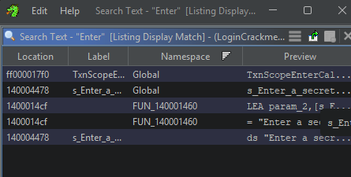
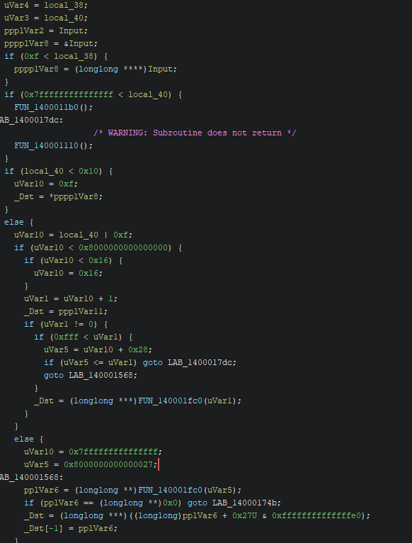
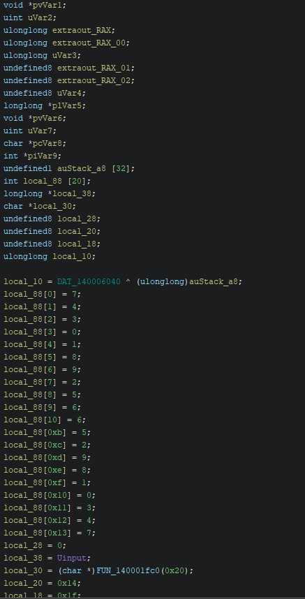
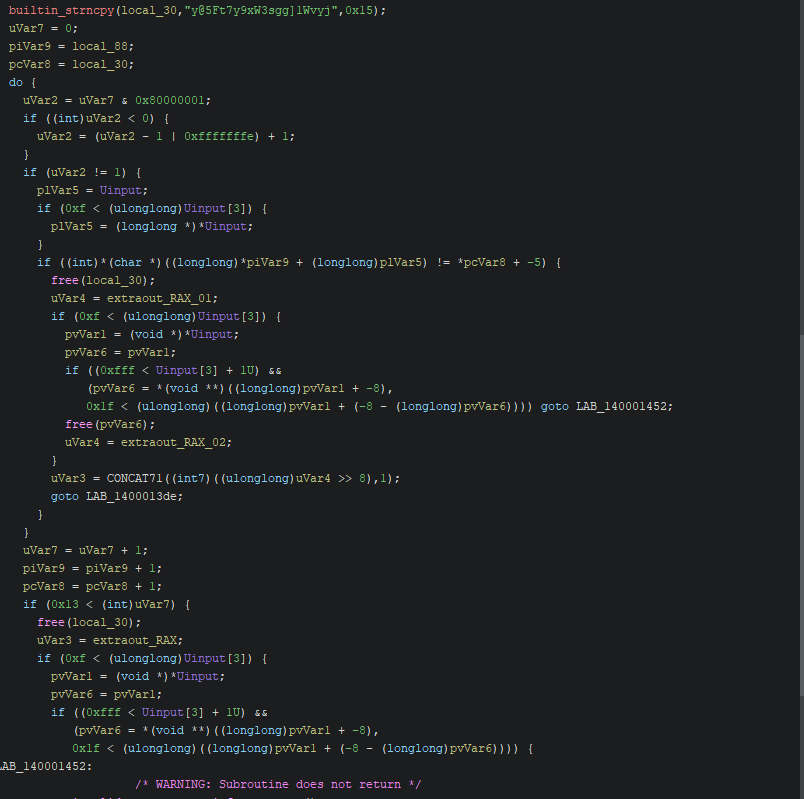
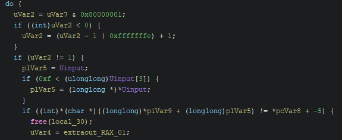
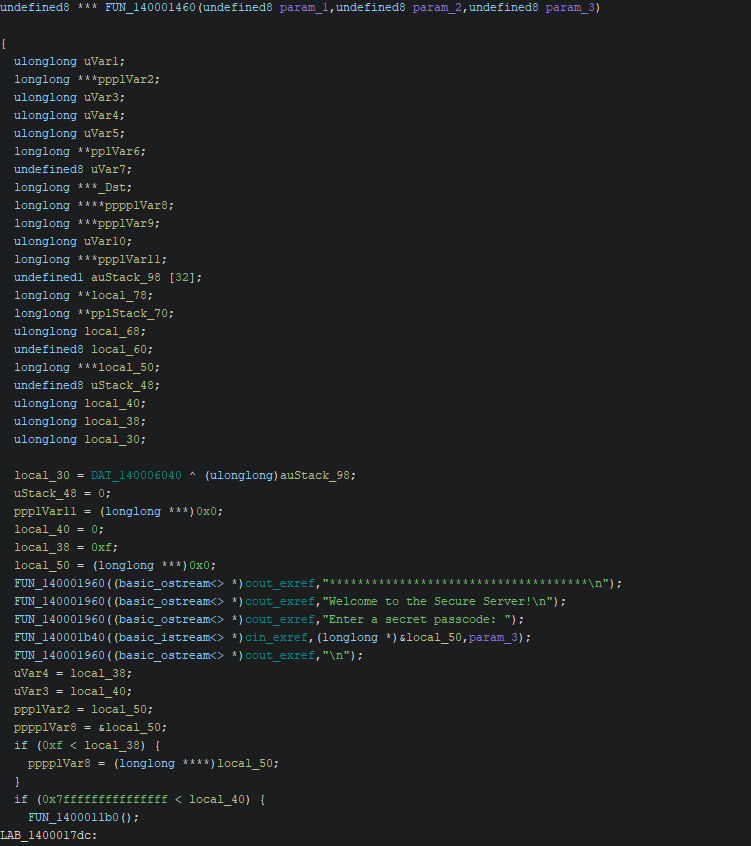

# CrackMe Write-Up: NoOff's LoginCrackme

| | |
|---|---|
| **Author (of CrackMe)** | [NoOff](https://crackmes.one/user/NoOff) |
| **Language** | C/C++ |
| **Platform** | Windows (x86-64) |
| **Difficulty** | 2.1 |
| **Quality** | 5.0 |
| **Upload Date** | 2024-06-10 |
| **Labels** | String / data encryption, XOR |

---

## Step 1: Initial Reconnaissance

Running the binary presents a login prompt:

```
Welcome to the Secure Server!
Enter a secret passcode:
```

Entering a random string triggers:

```
The passcode is INVALID!
```

A correct passphrase triggers success. Time to reverse engineer the validation logic.

---

## Step 2: String Searching

Searching for the string "Enter" in Ghidra reveals multiple references:



Following the references leads to the main validation function. The key strings to note:

```
"Welcome to the Secure Server!"
"Enter a secret passcode:"
"LOGIN SUCCESSFUL!!!"
"You did great! Now go rate this crackme.\n"
"The passcode is INVALID!\n"
```

These markers help identify the success/failure branches.

---

## Step 3: Main Validation Logic

The decompiled main function shows the core flow:



Key observations:
- User input is read into a buffer
- Multiple validation stages follow
- Success prints "LOGIN SUCCESSFUL!!!" and congratulates the user
- Failure prints "The passcode is INVALID!\n"

---

## Step 4: Stack Initialization & Hardcoded Values

Looking at the stack setup, we see hardcoded array initialization:



The function initializes `local_88[]` with specific byte values:

```
local_88[0] = 7;
local_88[1] = 4;
local_88[2] = 3;
local_88[3] = 0;
local_88[4] = 1;
local_88[5] = 8;
local_88[6] = 9;
local_88[7] = 2;
local_88[8] = 5;
local_88[9] = 6;
local_88[10] = 6;
local_88[0xb] = 5;
local_88[0xc] = 2;
local_88[0xd] = 9;
local_88[0xe] = 8;
local_88[0xf] = 5;
```

These values are used as lookup indices in subsequent operations.

---

## Step 5: XOR Decryption Chain

The validation involves complex XOR operations:



The pattern observed:
- XOR constants: `0x7fffffff`, `0x0ffffffff`, `0x0000000001`
- Character-by-character transformations
- Comparisons against dynamically computed values

---

## Step 6: Loop & Validation Logic

The core validation loop:



The algorithm:
1. Iterates through user input character by character
2. Applies XOR transformations using the hardcoded array as lookup indices
3. Compares each transformed character against an expected value
4. If any character fails, sets error flag and breaks
5. On success, prints congratulations message

---

## Step 7: Function Signature & Analysis

The validation function signature:



Three parameters are passed:
- param_1: User input string (from stdin)
- param_2: Expected passphrase reference
- param_3: Length/validation parameter

---

## Step 8: The Solution

By analyzing the hardcoded values and XOR operations, the expected passphrase is:

```
Rob0ts.tXt
```

Testing this against the binary:

```
Welcome to the Secure Server!
Enter a secret passcode: Rob0ts.tXt
LOGIN SUCCESSFUL!!!
You did great! Now go rate this crackme.
```

Success confirmed.

---

## Analysis Summary

This crackme demonstrates:
- **Static string analysis** — identifying success/failure markers
- **Stack-based obfuscation** — hardcoded lookup arrays
- **XOR transformations** — character-level encryption
- **Loop-based validation** — iterative character checking
- **Multi-stage checks** — complex control flow to obscure logic

The key to solving it was identifying the hardcoded array initialization and understanding how XOR operations transformed user input for comparison against expected values.
