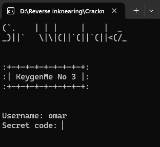
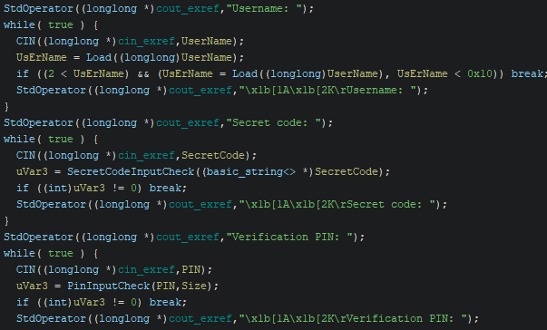
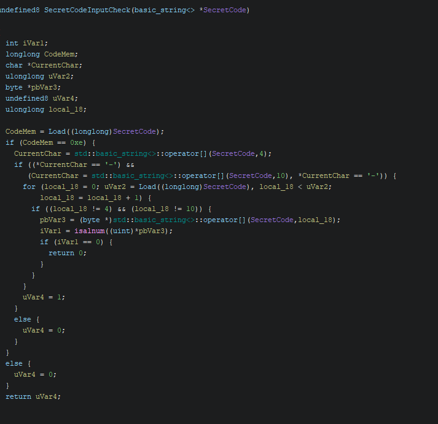
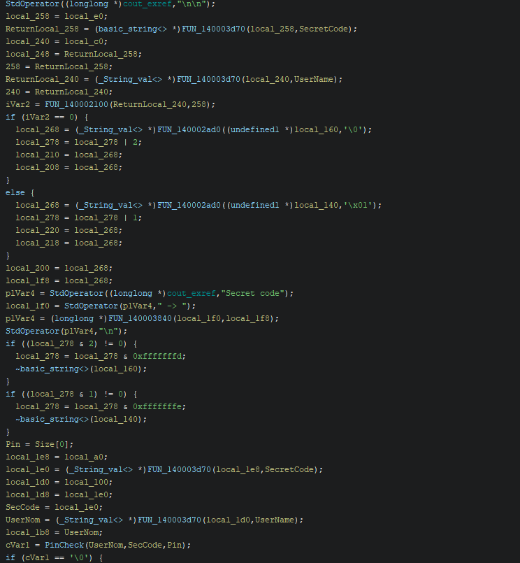
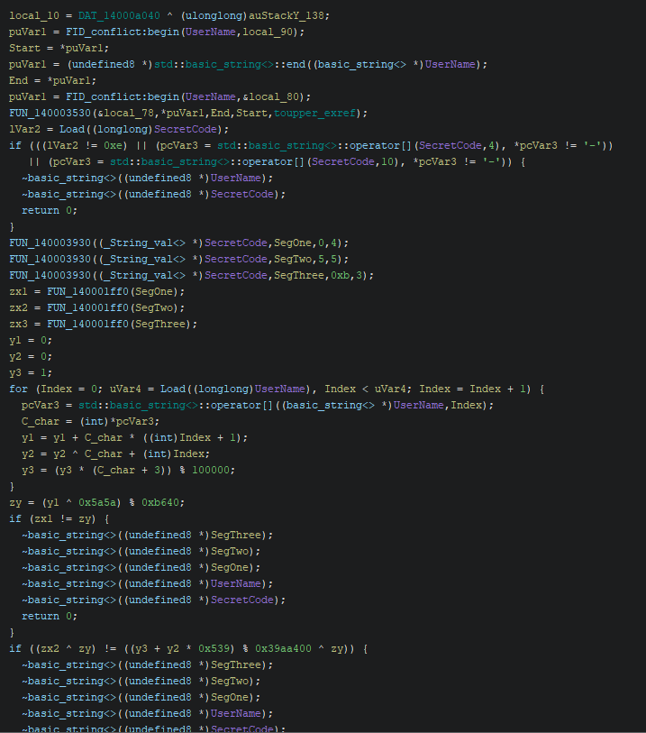
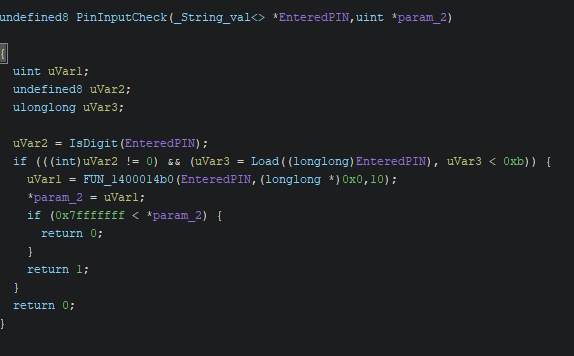
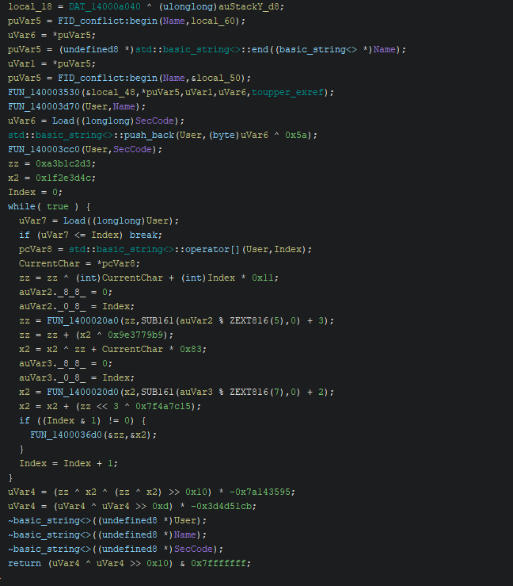
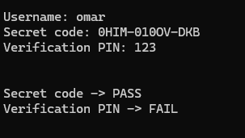
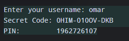
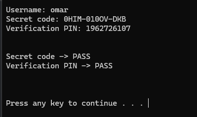

# CrackMe Write-Up: SirWardrake's KeygenMe_3_SWD

| | |
|---|---|
| **Author (of CrackMe)** | [SirWardrake](https://crackmes.one/user/SirWardrake) |
| **Language** | C/C++ |
| **Platform** | Windows (x86-64) |
| **Difficulty** | 3.3 |
| **Quality** | 4.7 |
| **Upload Date** | 2026-05-06 |
| **Labels** | KeyGen, Reversing, Math |

---

## Step 0: The Vibe Check

I open the exe. Asks for username. I enter my name (hasn't changed recently, trust me).

Then it asks for "Secret code."

So what do I do? I start doing finger push-ups. In other words, I'm spamming random inputs.

And somehow? I never left that hole. It kept asking for the secret code.

Have I fallen into the fifth dimension again? 

Meh, I was never a big fan of exe's anyways. Time to go visit my little dragon.

Ghidra.

---

## Step 1: Initial Analysis



I find these beautiful lines:

```c
uVar3 = SecretCodeInputCheck((basic_string<> *)SecretCode);
if ((int)uVar3 != 0) break;
    uVar3 = PinInputCheck(PIN,Size);
    if ((int)uVar3 != 0) break;
```

Two functions. Both interesting. Both equally annoying to reverse.

**The Input Handlers (because SirWardrake loves to torture us):**



First, the Secret Code checker:

```c
CodeMem = Load((longlong)SecretCode);
if (CodeMem == 0xe) {  // Length must be 14
    CurrentChar = std::basic_string<>::operator[](SecretCode,4);
    if ((*CurrentChar == '-') &&
       (CurrentChar = std::basic_string<>::operator[](SecretCode,10), 
        *CurrentChar == '-')) {
      // Check all chars are alphanumeric except dashes
```

**Translation:** The code must be exactly 14 characters long, with dashes at positions 4 and 10.

Format: `XXXX-XXXXX-XXX`

Then the PIN checker:

```c
uVar2 = IsDigit(EnteredPIN);
if (((int)uVar2 != 0) && (uVar3 = Load((longlong)EnteredPIN), uVar3 < 0xb)) {
    uVar1 = FUN_1400014b0(EnteredPIN,(longlong *)0x0,10);
```

**Translation:** PIN must be digits only, less than 11 characters (0xb), and greater than 0.

Thanks for that hint, Ghidra. I was totally thinking of entering a 39999-character PIN.

---

## Step 2: The Secret Code Algorithm



Now the actual work:

```c
FUN_140003930((_String_val<> *)SecretCode,SegOne,0,4);
FUN_140003930((_String_val<> *)SecretCode,SegTwo,5,5);
FUN_140003930((_String_val<> *)SecretCode,SegThree,0xb,3);
zx1 = FUN_140001ff0(SegOne);
zx2 = FUN_140001ff0(SegTwo);
zx3 = FUN_140001ff0(SegThree);
```

First, we split the secret code into 3 segments:
- `SegOne`: First 4 characters (before first dash)
- `SegTwo`: Middle 5 characters (between dashes)
- `SegThree`: Last 3 characters (after second dash)

Then each segment gets processed by `FUN_140001ff0`:



```c
int FUN_140001ff0(_String_val<> *Seg) {
  zx = 0;
  for (each char in Seg) {
    if (char is digit '0'-'9'):
      zx = zx * 36 + (char - '0');
    else if (char is letter 'A'-'Z'):
      zx = zx * 36 + (char - 'A' + 10);
  }
  return zx;
}
```

**What's happening:** Base-36 conversion. Each segment becomes an integer.

---

## Step 3: The Y Variables (Math Time, Buckle Up)



```c
y1 = 0;
y2 = 0;
y3 = 1;

for (Index = 0; Index < username_length; Index++) {
    c_char = username[Index];
    y1 = y1 + c_char * (Index + 1);
    y2 = y2 ^ (c_char + Index);
    y3 = (y3 * (c_char + 3)) % 100000;
}

zy = (y1 ^ 0x5a5a) % 0xb640;
```

**Breaking it down:**
- `y1`: Weighted sum of characters
- `y2`: XOR chain of characters
- `y3`: Multiplicative accumulation (mod 100000)
- `zy`: Derived from y1, XORed with 0x5a5a, modulo 0xb640

These are used to validate the secret code:

**Validation equations:**
```
zx1 = zy
(zx2 ^ zy) = ((y3 + y2 * 0x539) % 0x39aa400 ^ zy)
zx3 + zx1 = (y1 + y3 + y2) % 0xb640 + zy
```

**Solving for zx values (algebra time, lil bro):**

For zx1: Already have it → `zx1 = zy`

For zx2: XOR both sides with zy → `zx2 = (y3 + y2 * 0x539) % 0x39aa400`

For zx3: Since zx1 = zy, subtract zx1 from both sides → `zx3 = (y1 + y3 + y2) % 0xb640`

Now we have our zx values. Convert them back to base-36 to get the secret code.

---

## Step 4: The Keygen (Code Generation)

Here's my Python implementation:

```python
username = input("Enter your username: ").strip().upper()
length = len(username)
y1 = 0
y2 = 0
y3 = 1

for i in range(length):
    c_char = username[i]
    y1 = y1 + ord(c_char) * (i + 1)
    y2 = y2 ^ (ord(c_char) + i)
    y3 = (y3 * (ord(c_char) + 3)) % 100000

zy = (y1 ^ 0x5A5A) % 0xB640
zx1 = zy
zx2 = (y3 + y2 * 0x539) % 0x39AA400
zx3 = (y1 + y3 + y2) % 0xB640

def base36_encode(value, length):
    result = []
    for _ in range(length):
        remainder = value % 36
        value = value // 36
        if remainder < 10:
            result.append(chr(remainder + 48))  # '0'-'9'
        else:
            result.append(chr(remainder + 55))  # 'A'-'Z'
    return ''.join(reversed(result))

seg1 = base36_encode(zx1, 4)
seg2 = base36_encode(zx2, 5)
seg3 = base36_encode(zx3, 3)

secret_code = f"{seg1}-{seg2}-{seg3}"
print("Secret Code:", secret_code)
```

**Test:**
```
Username: omar
Secret Code: 0HIM-010OV-DKB
```

It works. We got out of the spiral loop.

---

## Step 5: The PIN Algorithm (The Torture Begins)

Now for the PIN. Ghidra wasn't being kind and gave me some bullshit function name, but I dug through it.



The key insight: The PIN is generated using the username AND the secret code.

**What gets passed in:**
```c
uVar2 = FUN_1400025a0(Name, SecCode);
uVar3 = FUN_1400028d0(uVar2);  // Apply function to generated PIN
uVar3_entered = FUN_1400028d0(EnteredPIN);  // Apply same function to our PIN
uVar2 = uVar3 ^ uVar3_entered;  // XOR them
if (uVar2 == 0) success;  // If XOR is 0, PINs match
```

Since XOR(A, A) = 0, the entered PIN must equal the generated PIN.

**The hash function (the ugly part):**



```c
user_str = username + chr(len(seccode) ^ 0x5A) + seccode
// For "omar" + code of length 14:
// user_str = "OMAR" + chr(14 ^ 0x5A) + "0HIM-010OV-DKB"
// chr(14 ^ 0x5A) = chr(0x54) = 'T'
// user_str = "OMART0HIM-010OV-DKB"

zz = 0xA3B1C2D3
x2 = 0x1F2E3D4C

for each char in user_str:
    zz = zz ^ (char + index * 0x11)
    zz = rol32(zz, (index % 5) + 3)
    zz = zz + (x2 ^ 0x9E3779B9)
    
    x2 = x2 ^ (zz + char * 0x83)
    x2 = ror32(x2, (index % 7) + 2)
    x2 = x2 + ((zz << 3) ^ 0x7F4A7C15)
    
    if (index & 1):
        swap(zz, x2)

// Final mixing
x = (zz ^ x2 ^ ((zz ^ x2) >> 16)) * -0x7A143595
x = (x ^ (x >> 13)) * -0x3D4D51CB
return (x ^ (x >> 16)) & 0x7FFFFFFF
```

This is... complex. Bitwise operations, rotations, multiplications. The whole arsenal.

Do I care about understanding every line? No.

Do I care that I can just pass username and code into this function and get the PIN? **Yes.**

---

## Step 6: The PIN Keygen

Here's the function (with help from my precious AI for the bitwise ops):

```python
def pingenerator(name, seccode):
    def rol32(val, n):
        n &= 31
        val &= 0xFFFFFFFF
        return ((val << n) | (val >> (32 - n))) & 0xFFFFFFFF

    def ror32(val, n):
        n &= 31
        val &= 0xFFFFFFFF
        return ((val >> n) | (val << (32 - n))) & 0xFFFFFFFF

    def imul32(a, b):
        sa = a & 0xFFFFFFFF
        sb = b & 0xFFFFFFFF
        sa = sa - 0x100000000 if sa >= 0x80000000 else sa
        sb = sb - 0x100000000 if sb >= 0x80000000 else sb
        return (sa * sb) & 0xFFFFFFFF

    user_str = name + chr(len(seccode) ^ 0x5A) + seccode

    zz = 0xA3B1C2D3
    x2 = 0x1F2E3D4C

    for index, ch in enumerate(user_str):
        c = ord(ch)
        zz = (zz ^ (c + index * 0x11)) & 0xFFFFFFFF
        zz = rol32(zz, (index % 5) + 3)
        zz = (zz + (x2 ^ 0x9E3779B9)) & 0xFFFFFFFF

        x2 = (x2 ^ (zz + c * 0x83)) & 0xFFFFFFFF
        x2 = ror32(x2, (index % 7) + 2)
        x2 = (x2 + (((zz << 3) & 0xFFFFFFFF) ^ 0x7F4A7C15)) & 0xFFFFFFFF

        if index & 1:
            zz, x2 = x2, zz

    x = (zz ^ x2 ^ ((zz ^ x2) >> 16)) & 0xFFFFFFFF
    x = imul32(x, (-0x7A143595) & 0xFFFFFFFF)
    x = (x ^ (x >> 13)) & 0xFFFFFFFF
    x = imul32(x, (-0x3D4D51CB) & 0xFFFFFFFF)
    return (x ^ (x >> 16)) & 0x7FFFFFFF

code = "0HIM-010OV-DKB"
pin = pingenerator("OMAR", code)
print("PIN:", pin)
```

---

## Step 7: Testing (The Moment of Truth)



```
Username: omar
Secret Code: 0HIM-010OV-DKB
Verification PIN: 123

Secret code -> PASS
Verification PIN -> FAIL
```

The code passed but PIN failed. Makes sense — 123 is random garbage.

Now with the correct PIN:



```
Username: omar
Secret Code: 0HIM-010OV-DKB
Verification PIN: 1962726107
```



```
Secret code -> PASS
Verification PIN -> PASS

Press any key to continue . . .
```

**Success.** The keygen works perfectly.

---

## Step 8: Binary Patching (For the Lazy)

If you want to bypass without figuring out the math, here's how to patch:

**For the secret code check:**
```
Original: CMP dword ptr [RSP + local_e8], zy
          JZ LAB_140002454
          
Patch:    NOP (replace with 0x90)
          JMP LAB_140002454 (force jump to success)
```

**For the PIN check:**
```
Original: TEST Name, Name
          JNZ LAB_140002a6b
          
Patch:    NOP all the conditional checks
          Force return success
```

But honestly? The keygen approach is cleaner. And way more satisfying.

---

## Analysis Summary

**Difficulty Assessment:** This is rated 3.3, but honestly?

The secret code algorithm is 2.8-level (weighted sum + XOR + modular arithmetic).

The PIN algorithm is 3.5+ level (advanced hash mixing with bitwise operations, rotations, state swapping).

Overall: **3.2-3.5 difficulty.** The rating feels fair because most people would get stuck on the PIN function and give up.

**Key Insights:**
- Base-36 encoding of segments
- Weighted math operations on username
- Complex hash mixing function (not meant to be reverse-engineered manually)
- XOR validation pattern

**Why I didn't reverse the PIN function completely:** Because I didn't need to. Once I realized the function takes (username, code) as input, I could just call it directly and get the PIN. That's the real win — knowing WHAT to pass in, not understanding every bitwise operation.

---

## Final Message

Dear SirWardrake, you tortured me with this PIN function.

But hey, it works. The keygen is complete. The crackme is solved.

And after all of this... it crashes.

So who cares? 🤷

*P.S. — To anyone reading this: If you fall into the "secret code" spiral loop like I did, just remember: you're not in the fifth dimension. You're just stuck in input validation hell. Ghidra will set you free.*
