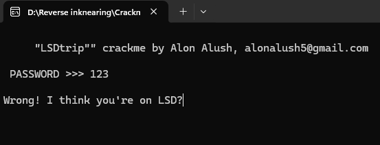
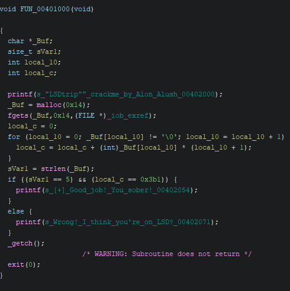
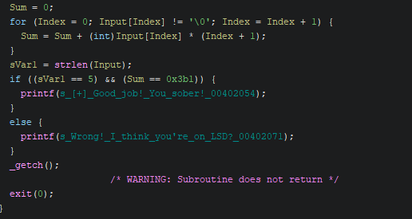
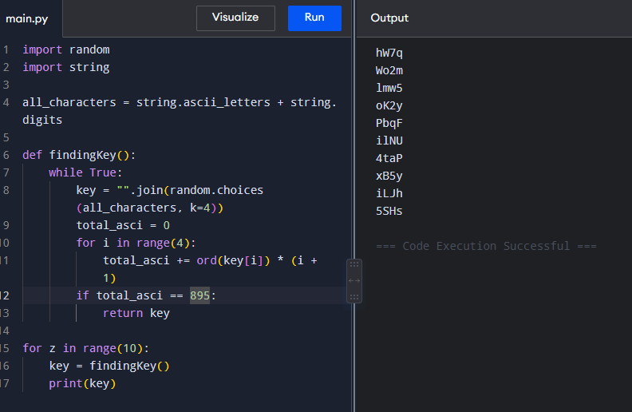
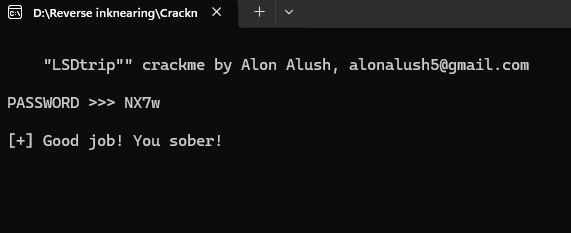

# CrackMe Write-Up: Tut's LSDtrip

| | |
|---|---|
| **Author (of CrackMe)** | [Tut](https://crackmes.one/user/Tut) |
| **Language** | C/C++ |
| **Platform** | Windows (x86) |
| **Difficulty** | 2.5 |
| **Quality** | 4.8 |
| **Upload Date** | 2024-11-20 |

---

## Step 1: First Run — Personal Accusation

Fire up the binary. Enter `123`.



```
Wrong! I think you're on LSD?
```

Okay, so not only does it reject my password, it's personally accusing me of being on LSD. I'm taking this personally now.

---

## Step 2: Main Function Analysis

Open Ghidra, find the main function. It's too short for all this yapping, but here it is:



```c
void FUN_00401000(void)
{
  char *_Buf;
  size_t sVar1;
  int local_10;
  int local_c;

  printf(s_"LSDtrip""_crackme_by_Alon_Alush_00402000);
  _Buf = malloc(0x14);
  fgets(_Buf, 0x14, (FILE *)_iob_exref);
  local_c = 0;
  for (local_10 = 0; _Buf[local_10] != '\0'; local_10 = local_10 + 1) {
    local_c = local_c + (int)_Buf[local_10] * (local_10 + 1);
  }
  sVar1 = strlen(_Buf);
  if ((sVar1 == 5) && (local_c == 0x3b1)) {
    printf(s_[+]_Good_job!_You_sober!_00402054);
  }
  else {
    printf(s_Wrong!_I_think_you're_on_LSD?_00402071);
  }
  _getch();
  exit(0);
}
```

Notice `fgets(_Buf, 0x14, (FILE *)_iob_exref)` — we're storing input in `_Buf` with 0x14 (20 bytes) allocated. Who cares about the exact size anyway.

---

## Step 3: Understanding the Sum Calculation

Let me rename things to make it cleaner:

- `_Buf` → `Input`
- `local_10` → `Index`
- `local_c` → `Sum`



```c
local_c = 0;
for (local_10 = 0; _Buf[local_10] != '\0'; local_10 = local_10 + 1) {
  local_c = local_c + (int)_Buf[local_10] * (local_10 + 1);
}
```

Much cleaner, isn't it my precious little snippet?

**The algorithm:**
We're going through the input character by character, multiplying each character's ASCII value by its position (starting from 1), then adding to sum.

**The checks:**
```c
if ((sVar1 == 5) && (local_c == 0x3b1)) {
  printf(s_[+]_Good_job!_You_sober!_00402054);
}
```

Two conditions:
- Input length must be 5
- Sum must equal 0x3b1 (945 in decimal)

---

## Step 4: The Newline Trap

Here's where it gets interesting. `fgets` counts the newline character (`\n`).

If you enter 4 letters, `fgets` reads it as 4 letters + `\n` = 5 characters total.

So when the program checks `strlen(_Buf) == 5`, it's actually checking for 4 printable characters + newline.

**The problem:** The newline (ASCII 10) gets included in the sum calculation at position 5:
- Sum = (input chars) + (10 * 5) = 945

So the actual sum of just the 4 printable characters must be:
- 945 - 50 = **895**

Holy molly, so we've been tricked. We only got 4 letters + newline, not 5 letters.

---

## Step 5: Python Keygen

Write a script to brute-force 4-character combinations:



```python
def findingKey():
    all_characters = "abcdefghijklmnopqrstuvwxyzABCDEFGHIJKLMNOPQRSTUVWXYZ0123456789"
    
    while True:
        key = "".join(random.choices(all_characters, k=4))
        total_asci = 0
        for i in range(4):
            total_asci += ord(key[i]) * (i + 1)
        
        if total_asci == 895:
            return key

for z in range(10):
    key = findingKey()
    print(key)
```

This can generate more passwords than the seconds you've lived in your life. Maybe a turtle reading this is here and not here at the same time (quantum turtle joke).

Anyway, the script spits out valid 4-character combinations. You're the one on LSD, not me!

---

## Step 6: Testing the Solution

Enter one of the generated passwords:



```
PASSWORD >>> NX7w
[+] Good job! You sober!
```

Success.

---

## Analysis Summary

**The Challenge:**
- Math-based validation using weighted character sum
- Length check that silently includes the newline
- Multiple valid solutions (any 4-char combo summing to 895)
- The trap: understanding how `fgets` behaves

**Key Takeaway:**
The difference between 2.0 and 2.5 difficulty is the little things you miss. The newline wasn't explicitly mentioned in the logic, but it silently affected everything. That's the real test.

Also, Alon Alush has jokes. I respect that.
