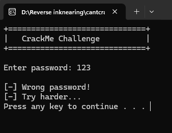
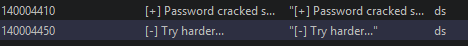
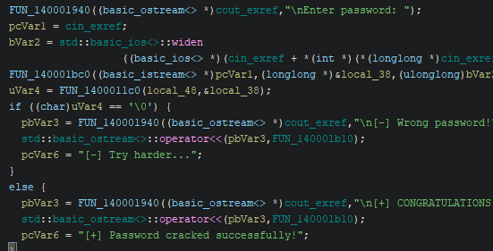
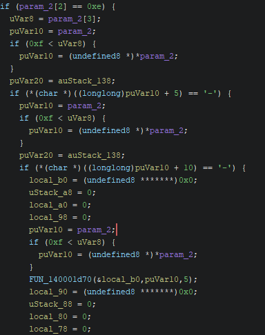
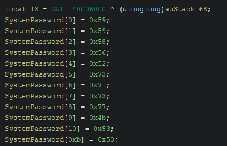
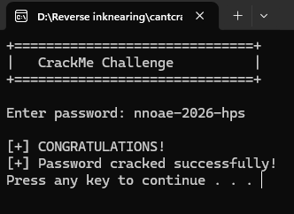

# CrackMe Write-Up: admin31's cantcrack

| | |
|---|---|
| **Author (of CrackMe)** | [admin31](https://crackmes.one/user/admin31) |
| **Language** | C/C++ |
| **Platform** | Windows (x86-64) |
| **Difficulty** | 2.2 |
| **Quality** | 4.5 |
| **Upload Date** | 2026-06-16 |
| **Labels** | String / data encryption, XOR |

---

## Step 1: First Run

Opening the binary and throwing a random guess at it (`123`) gives us a clean rejection, but the output text is worth keeping around for string searching later:


*First run — wrong password message, useful strings to search for later.*

---

## Step 2: String Searching in Ghidra

Searching the defined strings turns up two interesting hits: `"password cracked"` and `"try harder"` — almost certainly the success and failure triggers.


*Search results for the success and failure trigger strings.*

Following those strings back to their call sites lands us in the main check:

```c
FUN_140001940((basic_ostream<> *)cout_exref, "\nEnter password: ");
pcVar1 = cin_exref;
bVar2 = std::basic_ios<>::widen
                ((basic_ios<> *)(cin_exref + *(int *)(*(longlong *)cin_exref + 4)), '\n');
FUN_140001bc0((basic_istream<> *)pcVar1, (longlong *)&local_38, (ulonglong)bVar2);
uVar4 = FUN_1400011c0(local_48, &local_38);
if ((char)uVar4 == '\0') {
    pbVar3 = FUN_140001940((basic_ostream<> *)cout_exref, "\n[-] Wrong password!");
    std::basic_ostream<>::operator<<(pbVar3, FUN_140001b10);
    pcVar6 = "[-] Try harder...";
}
else {
    pbVar3 = FUN_140001940((basic_ostream<> *)cout_exref, "\n[+] CONGRATULATIONS!");
    std::basic_ostream<>::operator<<(pbVar3, FUN_140001b10);
    pcVar6 = "[+] Password cracked successfully!";
}
```


*Decompiled main check — calling into the password validation function.*

The input clearly lands in `local_38`, and it's compared directly against `local_48` — which looks like either a generated or hardcoded flag. Renaming for clarity: `local_48` → **`SystemPassword`**, `local_38` → **`UserPassword`**, and `FUN_1400011c0` → **`PasswordCheck`**.

---

## Step 3: Cracking the Format

Jumping into `PasswordCheck` — a solid 350 lines, so definitely not something to read top to bottom. If you try to read every single line in reverse engineering you *will* lose your mind. Better to scan for anything that looks like a real condition and work outward from there. First, rename the params: `param1` → **`SystemPassword`**, `param2` → **`UserPassword`**.

The first thing that stands out:

```c
if (UserPassword[2] == 0xe) {
    uVar8 = UserPassword[3];
    puVar10 = UserPassword;
    if (0xf < uVar8) {
        puVar10 = (undefined8 *)*UserPassword;
    }
    puVar20 = auStack_138;
    if (*(char *)((longlong)puVar10 + 5) == '-') {
        puVar10 = UserPassword;
        if (0xf < uVar8) {
            puVar10 = (undefined8 *)*UserPassword;
        }
        puVar20 = auStack_138;
        if (*(char *)((longlong)puVar10 + 10) == '-') {
            local_b0 = (undefined8 *******)0x0;
            uStack_a8 = 0;
            local_a0 = 0;
            local_98 = 0;
            puVar10 = UserPassword;
            if (0xf < uVar8) {
                puVar10 = (undefined8 *)*UserPassword;
            }
            FUN_140001d70(&local_b0, puVar10, 5);
            local_90 = (undefined8 *******)0x0;
            uStack_88 = 0;
            local_80 = 0;
            local_78 = 0;
            if ((ulonglong)UserPassword[2] < 6) {
LAB_14000174b:
                FUN_140002080();
                pcVar1 = (code *)swi(3);
                uVar8 = (*pcVar1)();
                return uVar8;
            }
            ...
```


*PasswordCheck logic — validating the serial pattern character by character.*

Interesting — the total length is fixed at exactly 14 characters (`UserPassword[2] == 0xe`), and there's a check for a `-` at position 5 and another `-` at position 10. Classic serial-key pattern:

```
XXXXX-XXXX-???
```

Doing the math (5 + 1 + 4 + 1 = 11, leaves 3 remaining out of 14) confirms the final segment is 3 characters:

```
XXXXX-XXXX-XXX
```

---

## Step 4: The XOR Chain

Skipping past more boilerplate slicing/copying code, the real logic shows up here:

```c
FUN_140001d70(&local_70, (void *)((longlong)UserPassword + 0xb), sVar9);
local_118 = *SystemPassword ^ 0x37;
local_117 = SystemPassword[1] ^ 0x37;
local_116 = SystemPassword[2] ^ 0x37;
local_115 = SystemPassword[3] ^ 0x37;
local_114 = SystemPassword[4] ^ 0x37;
```

Characters 0 through 4 of `SystemPassword` get XORed with `0x37`. A bit further down, the same pattern repeats with a different key:

```c
local_118 = SystemPassword[5] ^ 0x41;
local_117 = SystemPassword[6] ^ 0x41;
local_116 = SystemPassword[7] ^ 0x41;
local_115 = SystemPassword[8] ^ 0x41;
```

Characters 5 through 8 XORed with `0x41`. And again, one more time:

```c
local_118 = SystemPassword[9] ^ 0x23;
local_117 = SystemPassword[10] ^ 0x23;
local_116 = SystemPassword[0xb] ^ 0x23;
```

Characters 9 through 11 XORed with `0x23`. So the full breakdown is:

- Bytes `0–4` → XOR `0x37`
- Bytes `5–8` → XOR `0x41`
- Bytes `9–11` → XOR `0x23`

Finding the actual stored values at each index gives us the raw bytes that, once XORed back, reconstruct the real password.

---

## Step 5: Extracting the Key

Back at the top of the function, the raw `SystemPassword` bytes are hardcoded:

```c
local_18 = DAT_140006000 ^ (ulonglong)auStack_68;
SystemPassword[0] = 0x59;
SystemPassword[1] = 0x59;
SystemPassword[2] = 0x58;
SystemPassword[3] = 0x56;
SystemPassword[4] = 0x52;
SystemPassword[5] = 0x73;
SystemPassword[6] = 0x71;
SystemPassword[7] = 0x73;
SystemPassword[8] = 0x77;
SystemPassword[9] = 0x4b;
SystemPassword[10] = 0x53;
SystemPassword[0xb] = 0x50;
```


*Hardcoded SystemPassword byte array before the XOR pass.*

Running each byte through its corresponding XOR key (and mapping the results back to ASCII) gives:

```
nnoae-2026-hps
```

Since the comparison is a direct match against user input, this has to be the validation key. Testing it against the binary:


*Successful run — entering "nnoae-2026-hps" triggers the success message.*

Correct on the first try.

---

## Step 6: Patch Option (For the Lazy)

If keygenning isn't your thing and you just want a pass-through, there's a direct patch target:

```asm
14000186a 74 25    JZ    LAB_140001891
```

Where `LAB_140001891` is the wrong-password branch. A well-placed `NOP` on that jump always saves the day for a noob — well, not *always*, but it's worth a shot.

Until next time. ;)
