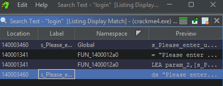
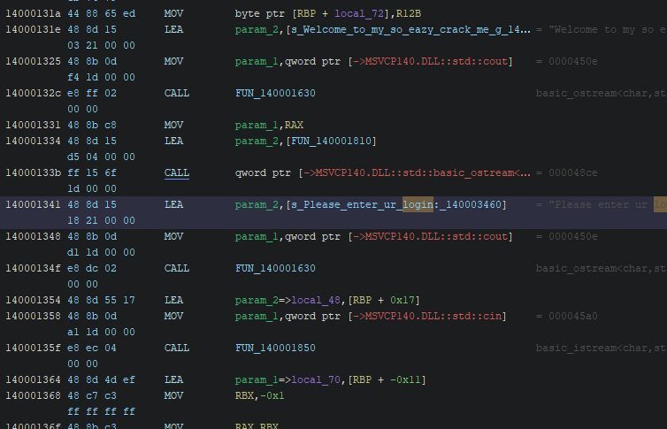
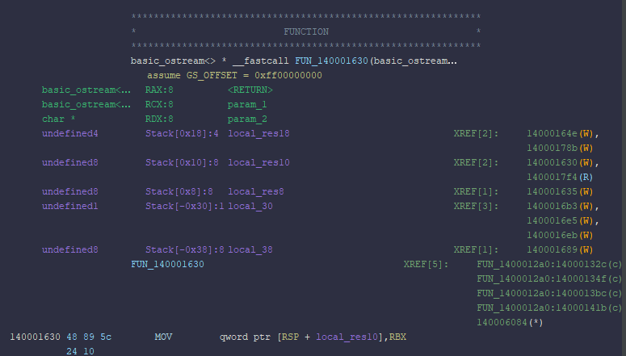
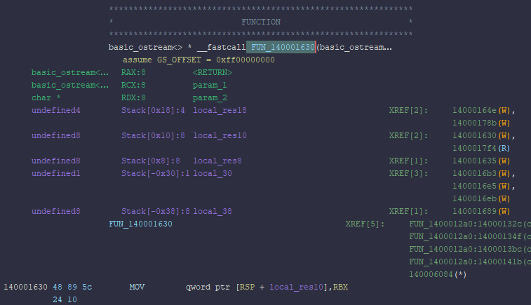

# CrackMe Writeup

Reverse engineering analysis and solution for a simple login/password CrackMe.

| | |
|---|---|
| **Tool used** | Ghidra |
| **Language** | C/C++ |
| **Platform** | Windows (x86-64) |
| **Difficulty** | 1.6 |

---

## Step 1 — Initial Testing & String Recon

I started by running the executable to see its behavior:

```
Welcome to my so eazy crack me good luck by whekkees
Please enter ur login:
123
```

No explicit failure message appeared, but that doesn't mean there aren't success checks hidden inside.

I started searching for the string `"good"`, which led me to the main function. But what if the author used `"correct"` instead of `"good"`? I decided to search for something guaranteed to exist in the code which we found on startup: `"login"`.

Searching for `"login"` gave 4 results. Ignoring the global references and focusing on the actual function call, I found where the prompt happens.


*Search results for the string "login" in Ghidra.*

---

## Step 2 — Identifying Key Helper Functions

While analyzing the execution flow, I identified two key wrapper functions and renamed them:

- `FUN_140001630` → **`PrintChar`** (handles `std::cout` output)
- `FUN_140001850` → **`InputLong`** (handles `std::cin` input)


*Decompiled view showing the login prompt call site.*

---

## Step 3 — Decompiler Analysis & Logic Flow

Looking at the main decompiled logic:

```c
PrintChar((basic_ostream<> *)cout_exref, "Please enter ur login: \n");
InputLong((basic_istream<> *)cin_exref, (longlong *)&local_48, param_3);
uVar3 = local_30;
pppuVar2 = local_48;
sVar6 = 0xffffffffffffffff;

do {
    sVar5 = sVar6 + 1;
    lVar1 = sVar6 + 1;
    sVar6 = sVar5;
} while (local_70[lVar1] != '\0');

ppppuVar7 = &local_48;
if (0xf < local_30) {
    ppppuVar7 = (undefined8 ****)local_48;
}
ppppuVar8 = (undefined8 ****)local_68;

if ((local_38 == sVar5) &&
   ((sVar6 = local_38, local_38 == 0 ||
    (iVar4 = memcmp(ppppuVar7, local_70, local_38), ppppuVar8 = (undefined8 ****)local_68, iVar4 == 0)))) {

    PrintChar((basic_ostream<> *)cout_exref, "Please enter ur password: \n");
    InputLong((basic_istream<> *)cin_exref, (longlong *)&local_68, sVar6);
    // ... password checks ...
    PrintChar((basic_ostream<> *)cout_exref, "Nice job bro ");
}
```

### Analyzing the Check Logic

The most critical line is the `memcmp` evaluation:

```c
if ((local_58 == sVar5) &&
   ((local_58 == 0 || (iVar4 = memcmp(ppppuVar7, local_78, local_58), iVar4 == 0)))) {
    PrintChar((basic_ostream<> *)cout_exref, "Nice job bro ");
}
```

This is the standard C++ pattern for comparing two buffers. `iVar4` returns `0` if the buffers match, triggering the `"Nice job bro "` output.

Tracing `ppppuVar7` back to `InputLong`:

1. User input is read into `local_48`.
2. `pppuVar2` and `ppppuVar7` point to this buffer.
3. Therefore, `ppppuVar7` is our input, and `local_70` / `local_78` store the expected values.

Checking where `local_70` and `local_78` are assigned:

```c
builtin_strncpy(local_70, "whekkes", 8);
builtin_strncpy(ActualPassword, "qwerty", 7);
```


*Function signature and stack layout for FUN_140001630 (PrintChar).*


*Cross-references to FUN_140001630 confirming its usage as an output wrapper.*

### Credentials Found

| Field | Value |
|---|---|
| **Login** | `whekkes` |
| **Password** | `qwerty` |

---

## Step 4 — Binary Patching Method

To bypass these checks entirely without entering credentials:

1. Locate the conditional jump for the password check:

   ```asm
   140001409 85 c0      TEST  EAX, EAX
   14000140b 75 19      JNZ   LAB_140001426
   ```

2. Replace `JNZ` (`75 19`) with `NOP` instructions (`90 90`).
3. Repeat for the login check conditional jump at `140001396` (`0F 85 86 00 00 00` → `NOP` x 6). 
4-Their is also other conditions but the steps remain the same
We end up with a fixed code:
```c
  sVar7 = local_38;
  memcmp(EnteredPassword,local_70,local_38);
  PrintChar((basic_ostream<> *)cout_exref,"Please enter ur password: \n");
  InputLong((basic_istream<> *)cin_exref,(longlong *)&local_68,sVar7);
  uVar3 = local_50;
  pvVar2 = local_68;
  PrintChar((basic_ostream<> *)cout_exref,"Nice job bro ");
  ```

This forces execution directly to `"Nice job bro "` regardless of input.

---
that's nice job bro
See you next time ;)
