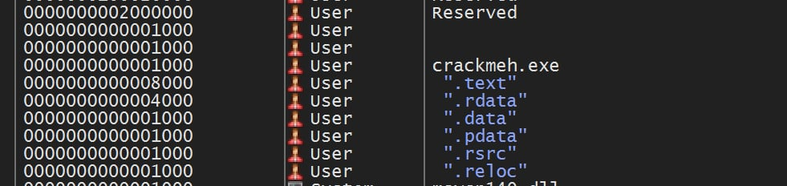
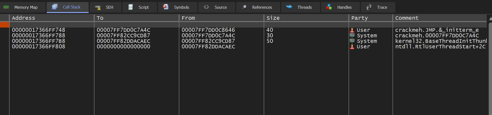
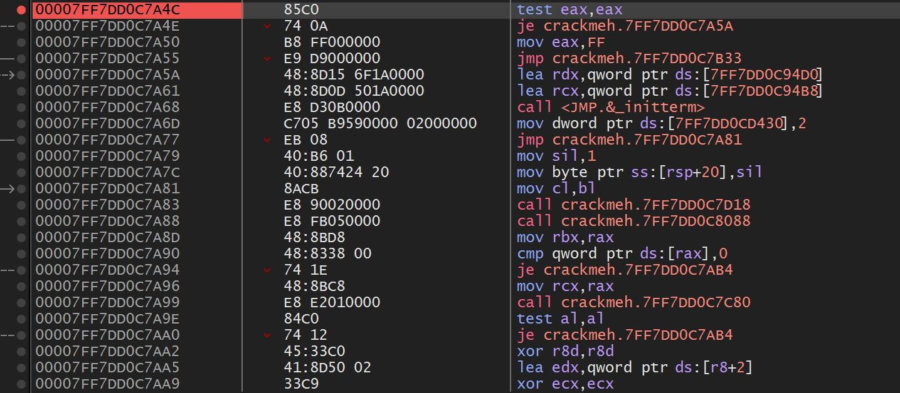
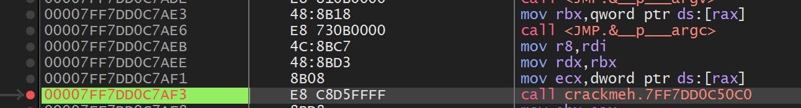
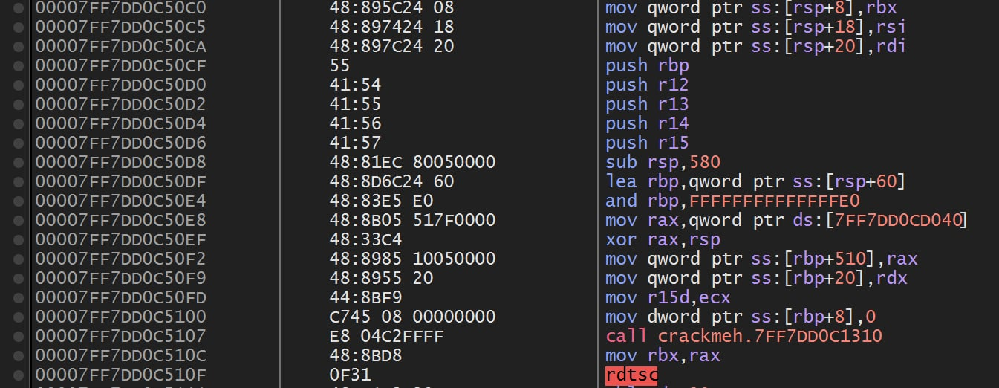
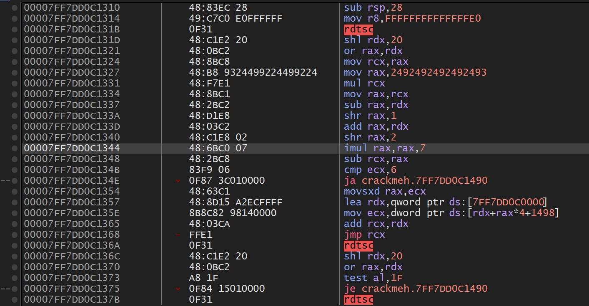
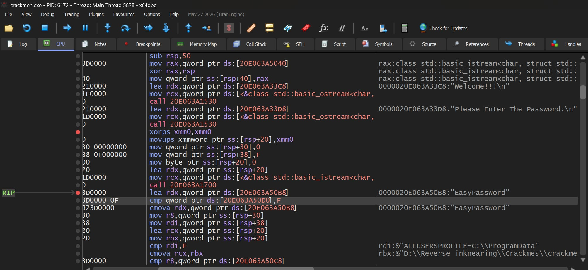
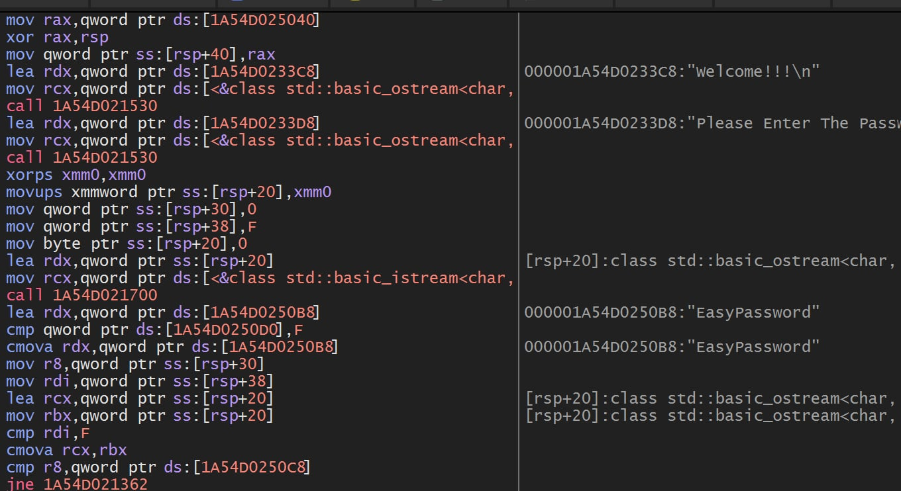
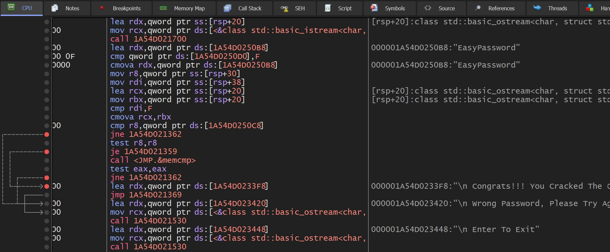
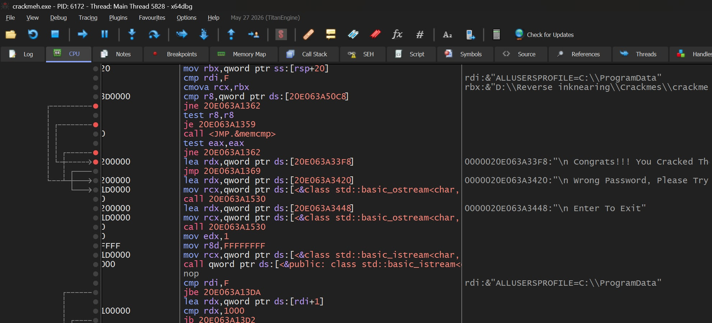

# niko122's impossible console crack me

🔗 **Link:** [crackmes.one](https://crackmes.one/) <!-- replace with the direct crackme page URL -->

| | |
|---|---|
| **Author** | niko122 |
| **Language** | C/C++ |
| **Platform** | Windows |
| **Arch** | x86-64 |
| **Difficulty** | 3.7 |
| **Quality** | 5.0 |
| **Size** | 67.72 KB |
| **Uploaded** | 2026-02-27 05:13 |
| **Tools** | x64dbg |

---

Welcome to a new day of learning how to walk in reverse engineering.

If you're a rookie dealing with anti-tamper, anti-debugging, string obfuscation and packers, welcome, rookie.

## First Contact

Upon opening the exe we get:

```text
Welcome!!!
Please Enter The Password:
```

The classic welcome message we say to visitors. Upon entering the magical word `omar` (the special name, for sure), I get a wrong password.

What a surprise.

## Sizing It Up

Upon analyzing the section sizes of crackmeh, we see that `.text` (0x8000) is bigger than `.rdata` (0x4000) and `.rsrc` (0x1000). Hmm, interesting when dealing with packers.



Time to find our way into the real code. A breakpoint is reached. Amazing.

## Where Are We?

Upon inspecting the call stack, we immediately notice the address range. The top frame is `_initterm_e`, so we are inside the CRT startup code.



```asm
00007FF7DD0C7A4C | 85C0 | test eax,eax |
```



Thank you, babe.

> **Note:** this is `__scrt_common_main_seh`, the MSVC CRT startup routine. `_initterm_e` runs the C initializers and returns nonzero on failure, so `test eax,eax` decides whether startup continues. The next `_initterm` runs the C++ static initializers, and `main` is called shortly after.

## Finding Main

Now it's time to find the classic three arguments followed by a call. Three movs followed by a jmp or a call is probably our call to main:



```asm
00007FF7DD0C7AE6 | E8 730B0000  | call <JMP.&__p___argc>
00007FF7DD0C7AEB | 4C:8BC7      | mov r8,rdi   ; r8:&"ALLUSERSPROFILE=C:\ProgramData"
00007FF7DD0C7AEE | 48:8BD3      | mov rdx,rbx  ; rdx:&"D:\Reverse inknearing\Crackmes\crackmeh.exe"
00007FF7DD0C7AF1 | 8B08         | mov ecx,dword ptr ds:[rax]
00007FF7DD0C7AF3 | E8 C8D5FFFF  | call crackmeh.7FF7DD0C50C0
```

> **Note:** this matches `main(int argc, char** argv, char** envp)` under the Windows x64 calling convention:
>
> | Register | Argument | Value here |
> |----------|----------|------------|
> | `ecx` | `argc` | `[rax]`, from `__p___argc` |
> | `rdx` | `argv` | `argv[0]` is the exe path |
> | `r8` | `envp` | first environment variable |

Inside the call:



```asm
00007FF7DD0C50C0 | 48:895C24 08      | mov qword ptr ss:[rsp+8],rbx
00007FF7DD0C50C5 | 48:897424 18      | mov qword ptr ss:[rsp+18],rsi
00007FF7DD0C50CA | 48:897C24 20      | mov qword ptr ss:[rsp+20],rdi
00007FF7DD0C50CF | 55                | push rbp
00007FF7DD0C50D0 | 41:54             | push r12
00007FF7DD0C50D2 | 41:55             | push r13
00007FF7DD0C50D4 | 41:56             | push r14
00007FF7DD0C50D6 | 41:57             | push r15
00007FF7DD0C50D8 | 48:81EC 80050000  | sub rsp,580
00007FF7DD0C50DF | 48:8D6C24 60      | lea rbp,qword ptr ss:[rsp+60]
00007FF7DD0C50E4 | 48:83E5 E0        | and rbp,FFFFFFFFFFFFFFE0
00007FF7DD0C50E8 | 48:8B05 517F0000  | mov rax,qword ptr ds:[7FF7DD0CD040]
00007FF7DD0C50EF | 48:33C4           | xor rax,rsp
00007FF7DD0C50F2 | 48:8985 10050000  | mov qword ptr ss:[rbp+510],rax
00007FF7DD0C50F9 | 48:8955 20        | mov qword ptr ss:[rbp+20],rdx
00007FF7DD0C50FD | 44:8BF9           | mov r15d,ecx
00007FF7DD0C5100 | C745 08 00000000  | mov dword ptr ss:[rbp+8],0
00007FF7DD0C5107 | E8 04C2FFFF       | call crackmeh.7FF7DD0C1310
```

More compiler bullshit.

> **Note:** this is a standard MSVC prologue. Callee-saved registers are pushed, a large stack frame is reserved (`sub rsp,0x580`), the frame is aligned to 32 bytes, and the `/GS` stack cookie is loaded from `__security_cookie`, XORed with `rsp` and stored at `[rbp+510]`.

Now let's check this call. Okay, we're in, probably.

After all, what's the difference between reverse engineering and eating a food you're not gonna find out unless you fuck around and wait for the final result?

## Pattern Analysis

Okay, time for some basic pattern analysis. Okay, not so basic, it actually took me hours. Milli-hours, I meant.



```asm
00007FF7DD0C134E | 0F87 3C010000 | ja crackmeh.7FF7DD0C1490
```

This jump repeats a lot, and upon running I noticed that almost every time it is never taken, and nothing shows in the terminal. Combined with the constant `rdtsc` instructions, this looks like anti-debugging: the program reads the CPU timestamp counter and bails out to `1490` if too much time passes, which is what happens when you single-step.

I decided to keep going until the last `je`, as the real logic probably starts afterwards.

```asm
00007FF7DD0C13F5 | 0F84 95000000    | je crackmeh.7FF7DD0C1490
00007FF7DD0C13FB | 4C:8B05 C6BC0000 | mov r8,...
```

> **Note:** the magic constant `0x2492492492492493` followed by `mul`, `shr`, `imul rax,rax,7` and `sub rcx,rax` is the compiler's way of computing `tsc % 7` without a `div`. The result indexes a jump table (`cmp ecx,6` / `jmp rcx`), so the control flow depends on the timestamp and is non-deterministic.

## Password Logic

Here we go. After the last `je`, the addresses stop looking like `00007FF7DD0C....` and start looking like `0000020E063A....`. That is a runtime-allocated region outside `crackmeh.exe`, which is why the base changes between runs.





Comparing the length first, then checking if it matches `EasyPassword`:





```asm
cmp  rdi,F
cmova rcx,rbx          ; pick inline buffer or heap pointer
cmp  r8,[..50C8]       ; compare lengths first
jne  ..1362            ; different length -> wrong password
test r8,r8
je   ..1359            ; both empty -> skip memcmp
call memcmp
test eax,eax
jne  ..1362            ; mismatch -> wrong password
lea  rdx,[..33F8]      ; "Congrats!!! You Cracked The..."
```

> **Notes:**
> - `cmp rdi,F` / `cmova` is MSVC's `std::string` small string optimization. Strings with a capacity of 15 or less are stored inline in the object, and longer ones use a heap pointer.
> - In the `std::string` layout, the size is at `+0x10` and the capacity at `+0x18`. That is why our input uses `[rsp+30]` (size) and `[rsp+38]` (capacity), and the hardcoded password uses `50C8` and `50D0`.
> - `EasyPassword` is 12 characters, so the check is effectively `input.size() == 12 && memcmp(...) == 0`.

## Patching Methods

Just breakpoint at the `je`s and modify the flags, noob.

Or just type the password: `EasyPassword`.

## Answer

```text
EasyPassword
```

See you next time, probably a nuclear reactor, I guess.
