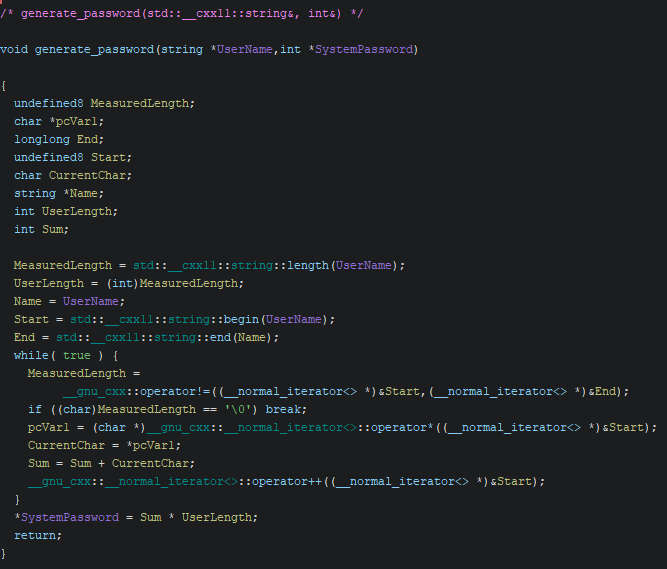
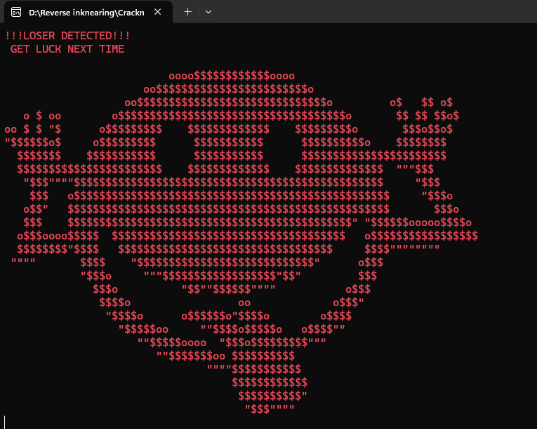
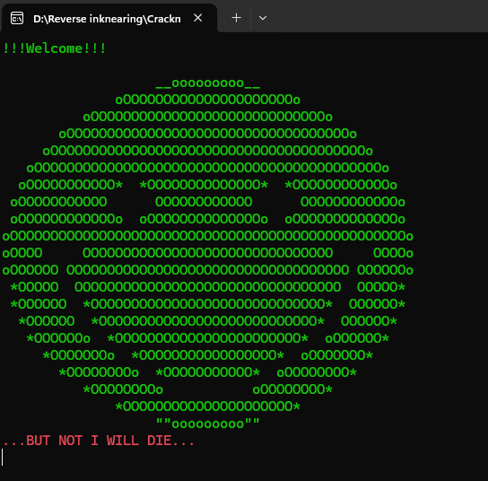
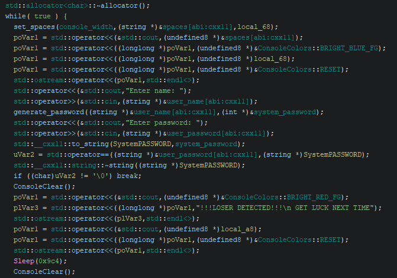
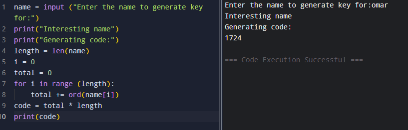
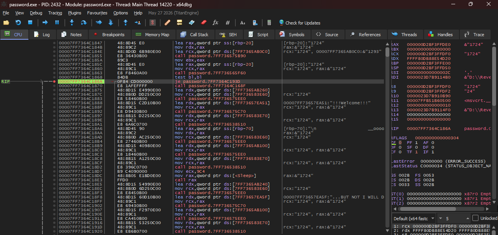

# CrackMe Write-Up: password.exe by j2cks1337

| | |
|---|---|
| **Author (of CrackMe)** | [j2cks1337](https://crackmes.one/user/j2cks1337) |
| **Language** | C/C++ |
| **Platform** | Windows (x86-64) |
| **Difficulty** | 1.9 |
| **Quality** | 4.2 |
| **Upload Date** | 2025-05-26 |

---

## Step 1: First Run

Running the binary immediately throws a bit of ragebait at you — big ASCII art and an obvious "access denied" energy before you've even entered anything real:


*Failed run — LOSER DETECTED ASCII art.*

Not exactly subtle. Time to open it in Ghidra and see what's actually gating that message.

---

## Step 2: Tracing the Input

First thing to check is where the input goes right after the name prompt:

```c
std::operator>>(&std::cin, (string *)&user_name[abi:cxx11]);
```

After renaming a few functions, the next line ends up being the most telling one:

```c
generate_password((string *)&user_name[abi:cxx11], (int *)&system_password);
```

Two parameters go in: the username and the system password. That immediately tells you the password **isn't hardcoded** — it's generated on the fly from whatever name you type. So the real target isn't a string comparison, it's the `generate_password` function itself.


*Main loop — the generate_password call, the password comparison, and the LOSER DETECTED branch.*

---

## Step 3: Cracking `generate_password`

Diving into `generate_password`, the first two lines are simple bookkeeping:

```c
MeasuredLength = std::__cxx11::string::length(UserName);
UserLength = (int)MeasuredLength;
```

Just grabbing the username length and storing it. Then:

```c
Name = UserName;
Start = std::__cxx11::string::begin(UserName);
End = std::__cxx11::string::end(Name);
```

This sets up the start and end iterators of the username string — basically fencing off the boundaries we're about to loop through.

Then the actual logic:

```c
while( true ) {
    MeasuredLength =
        __gnu_cxx::operator!=((__normal_iterator<> *)&Start, (__normal_iterator<> *)&End);
    if ((char)MeasuredLength == '\0') break;
    pcVar1 = (char *)__gnu_cxx::__normal_iterator<>::operator*((__normal_iterator<> *)&Start);
    CurrentChar = *pcVar1;
    Sum = Sum + CurrentChar;
    __gnu_cxx::__normal_iterator<>::operator++((__normal_iterator<> *)&Start);
}
```

We're iterating through the string character by character. Each letter gets converted to its ASCII code and added to `Sum`. By the end of the loop, `Sum` holds the total of every character's ASCII value in the username.

But that's not the final answer — one more step:

```c
*SystemPassword = Sum * UserLength;
```

At the very end, the accumulated sum gets multiplied by the username's length. That's the full formula.


*Decompiled body of generate_password — the ASCII sum loop and the final multiplication.*

---

## Step 4: Building the Keygen

With the formula fully mapped out, the Python keygen is straightforward:

```python
name = input("Enter the name to generate key for:")
print("Interesting name")
print("Generating code:")
length = len(name)
i = 0
total = 0
for i in range(length):
    total += ord(name[i])
code = total * length
print(code)
```

Testing with the name `omar` gives `1724`. Feeding that back into the CrackMe as the password:


*Python keygen generating the code 1724 for the name "omar".*


*Successful run — new ASCII art, still talking trash but this time it's welcoming you in.*

New face, friendlier tone, but still threatening you that it's "not dead yet." Sure — come back anytime, I'll be ready. 😉

---

## Step 5: Static & Dynamic Patch Options

Beyond the keygen, there's also a direct patch available on the comparison branch. Statically, the best target is:

```asm
14000186a 0f 84 cd 00 00 00   JZ    LAB_14000193d
```

Flipping `JZ` to `JNZ` inverts the logic entirely — the binary will now accept **every** password *except* the correct one. Funny, but useful for confirming exactly which instruction gates success.

Dynamically, the same result can be reached in x64dbg — either by reading the generated password straight out of memory at runtime, or by just flipping the Zero Flag at the comparison to force the branch either way:


*x64dbg session — the runtime comparison against the generated value "1724" in memory.*

---

*Writeup by whekkees.*
